```mermaid
graph TB
    subgraph "User Interface Layer"
        USER["👤 User (Fund Owner)"]
        CONSENT["🤠Consent Interface"]
    end
    
    subgraph "The Professor Layer - Supreme Fund Manager"
        PROF["📠The Professor<br/>(Autonomous Fund Manager)"]
        BRAIN["🧠 MCP Server<br/>(The Professor's Brain)"]
        THESIS["📋 Fund Thesis<br/>Management"]
    end
    
    subgraph "Agent Orchestration Layer"
        ORCHESTRATOR["🼠Agent Orchestrator"]
        SCHEDULER["â° Market Event Scheduler"]
        MONITOR["👀 Market Listener"]
    end
    
    subgraph "Dynamic Agent Pool - Modular & Scalable"
        ANALYST_POOL["📊 Analyst Pool<br/>(Market, Sentiment, News, Fundamentals)"]
        RESEARCH_POOL["🔠Research Pool<br/>(Bull, Bear, Manager)"]
        TRADING_POOL["💼 Trading Pool<br/>(Execution, Strategy)"]
        RISK_POOL["ğŸ›¡ï¸ Risk Pool<br/>(Analysis, Portfolio Management)"]
        CUSTOM_POOL["âš¡ Custom Pool<br/>(User-Defined Specialists)"]
    end
    
    subgraph "Enhanced Memory & State"
        FINANCIAL_MEM["💾 Financial Memory"]
        STRATEGY_MEM["📈 Strategy Memory"]
        PERFORMANCE_MEM["📊 Performance Memory"]
        DECISION_LOG["📠Decision Audit Log"]
        PROFESSOR_MEM["🧠 Professor Memory"]
    end
    
    subgraph "Execution & Trading Layer"
        PAPER_TRADE["📄 Paper Trading"]
        LIVE_TRADE["💰 Live Trading<br/>(Future Integration)"]
        PORTFOLIO_MGR["🦠Portfolio Manager"]
        ORDER_MGR["📋 Order Management"]
    end
    
    subgraph "Data Processing Layer"
        D[FinnHub API]
        E[Yahoo Finance]
        F[Reddit API]
        G[Google News]
        REALTIME[Real-time Market Data]
        EVENTS[Economic Calendar]
    end
    
    subgraph "LLM Backend"
        L[OpenAI API]
        M[gpt-4o-mini]
        LOCAL[Local DeepSeek Models - Future]
    end
    
    USER --> CONSENT
    CONSENT --> PROF
    PROF --> BRAIN
    PROF --> THESIS
    PROF --> ORCHESTRATOR
    ORCHESTRATOR --> SCHEDULER
    ORCHESTRATOR --> MONITOR
    
    BRAIN --> ANALYST_POOL
    BRAIN --> RESEARCH_POOL
    BRAIN --> TRADING_POOL
    BRAIN --> RISK_POOL
    BRAIN --> CUSTOM_POOL
    
    PROF --> FINANCIAL_MEM
    PROF --> STRATEGY_MEM
    PROF --> PERFORMANCE_MEM
    PROF --> DECISION_LOG
    PROF --> PROFESSOR_MEM
    
    ORCHESTRATOR --> PAPER_TRADE
    PAPER_TRADE --> LIVE_TRADE
    PORTFOLIO_MGR --> PAPER_TRADE
    PORTFOLIO_MGR --> LIVE_TRADE
    ORDER_MGR --> PORTFOLIO_MGR
    
    MONITOR --> D
    MONITOR --> E
    MONITOR --> F
    MONITOR --> G
    MONITOR --> REALTIME
    MONITOR --> EVENTS
    
    L --> PROF
    L --> ANALYST_POOL
    L --> RESEARCH_POOL
    L --> TRADING_POOL
    L --> RISK_POOL
    
    SCHEDULER -.-> ANALYST_POOL
    SCHEDULER -.-> RESEARCH_POOL
    SCHEDULER -.-> TRADING_POOL
```

# TradingAgents: Master Architecture & Development Plan

## 📋 Project Overview
**TradingAgents** is a multi-agent LLM framework for financial trading that simulates real-world trading firms through specialized AI agents collaborating on market analysis and trading decisions, managed by "The Professor" - an autonomous fund manager and personal assistant.

**Current Status**: ✅ Setup Complete | 🧪 Ready for Architecture Testing | 🗂️ Cache Management Added | 🎓 The Professor Design Phase  
**Last Updated**: 2024-01-15  
**Version**: v0.2.0-alpha

---

## 🏗️ Enhanced Architecture with The Professor



### 🔧 Enhanced Technical Stack
- **Framework**: LangGraph for agent orchestration
- **Supreme Manager**: The Professor (autonomous fund manager)
- **MCP Server**: The Professor's brain for tool access and agent management
- **LLMs**: OpenAI GPT-4o-mini (testing), planned DeepSeek (production)
- **Data Sources**: FinnHub, Yahoo Finance, Reddit, Google News, Real-time feeds
- **Memory**: Enhanced memory system with Professor memory and decision logging
- **Agent Management**: Dynamic agent pools with modular deployment
- **Fund Management**: Collaborative fund thesis development and management
- **Environment**: Python 3.9+, .env configuration, MCP protocol

---

## 📊 Current State Assessment

### ✅ Completed Components
- [x] **Environment Setup**: API keys, dependencies, .env configuration
- [x] **Core Agent Framework**: LangGraph-based multi-agent system
- [x] **Data Integration**: FinnHub, Yahoo Finance, Reddit APIs
- [x] **Basic Agent Types**: Market, Sentiment, News, Fundamentals analysts
- [x] **Memory System**: Agent memory for learning from past decisions
- [x] **CLI Interface**: Interactive command-line interface with cache management
- [x] **Configuration Management**: Fixed hardcoded paths, optimized for testing
- [x] **Secure API Management**: .env file support with automatic loading
- [x] **User-Friendly Interface**: Improved main.py with clear error messages
- [x] **Development Workflow**: Git setup with fork tracking and proper remotes
- [x] **Data Cache Management**: Ticker-specific directories, report saving, cache cleanup
- [x] **Report Persistence**: Final analysis reports saved to organized cache structure

### 🔄 In Progress
- [ ] **OpenAI API Access**: Resolving quota/billing setup (blocked)
- [ ] **Architecture Testing**: Validating agent interactions and decision flow
- [ ] **Cost Optimization**: Measuring and optimizing token usage

### 🎓 The Professor Implementation (NEW)
- [ ] **MCP Server Setup**: The Professor's brain and tool access system
- [ ] **Professor Agent Core**: Supreme fund manager with autonomous decision-making
- [ ] **Agent Orchestration**: Dynamic agent deployment and management
- [ ] **Hierarchical Agent Factory**: Category → Specialization → Fine-tuning system
- [ ] **Fund Thesis Management**: Collaborative investment philosophy development
- [ ] **Consent Management**: User approval system for major decisions
- [ ] **Market Event Listener**: Real-time monitoring and trigger system

### ❌ Pending
- [ ] **Historical Backtesting**: Testing against historical market data
- [ ] **Performance Metrics**: Quantitative evaluation of trading decisions
- [ ] **Local Model Integration**: DeepSeek model deployment
- [ ] **Scalability Testing**: Multi-asset, multi-timeframe analysis
- [ ] **Production Infrastructure**: Raspberry Pi cluster setup
- [ ] **Live Trading Integration**: Real broker connection and execution
- [ ] **Regulatory Compliance**: Trading regulations and audit systems

---

## 📝 Changelog

### v0.2.0-alpha (2024-01-15)
- **MAJOR**: Added "The Professor" - autonomous fund manager and supreme orchestrator
- **Added**: Enhanced architecture with MCP Server as The Professor's brain
- **Added**: Agent orchestration layer with dynamic agent pool management
- **Added**: Fund thesis management system for collaborative investment strategy
- **Added**: Consent management system for autonomous vs. user-approved decisions
- **Added**: Market event listener and scheduler for real-time triggers
- **Added**: Enhanced memory system with Professor memory and decision audit logs
- **Added**: Trading execution layer with paper trading foundation
- **Upgraded**: Architecture from simple agent coordination to autonomous fund management
- **Planning**: Roadmap updated with The Professor implementation phases

### v0.1.2-alpha (2024-01-15)
- **Added**: Complete data cache management system with interactive CLI
- **Added**: Ticker-specific directory structure for organized data storage
- **Added**: Automatic final report saving to cache directories
- **Added**: Cache scanning and deletion functionality with confirmation prompts
- **Added**: Step 0 cache management in CLI workflow before analysis
- **Improved**: Data organization with per-ticker directories instead of flat files
- **Improved**: User experience with cache cleanup and data management tools
- **Fixed**: DateTime import issues in CLI components
- **Security**: Added data cache directory to .gitignore to prevent commit of user data

### v0.1.1-alpha (2024-06-09)
- **Added**: Automatic .env file loading with tradingagents.env_loader
- **Added**: Comprehensive architecture planning document (ARCHITECTURE_PLAN.md)
- **Added**: python-dotenv dependency for secure API key management
- **Fixed**: Hardcoded paths in default_config.py (removed /Users/yluo/ references)
- **Fixed**: Model configuration inconsistencies (o4-mini → gpt-4o-mini)
- **Improved**: main.py with user-friendly CLI and error handling
- **Improved**: Git workflow setup with proper fork tracking
- **Changed**: Default configuration optimized for cost-efficient testing
- **Security**: Added .env to .gitignore for API key protection

### v0.1.0-alpha (2024-06-09)
- **Added**: Initial project setup and environment configuration
- **Added**: LangGraph-based agent framework
- **Added**: Multi-agent analyst team (Market, Sentiment, News, Fundamentals)
- **Added**: Research team with Bull/Bear researchers
- **Added**: Trading and Risk Management agents
- **Added**: CLI interface for interactive testing

---

## 🧪 Phase 1: Architecture Testing & Validation

### Immediate Next Steps (Week 1-2)

1. **OpenAI API Resolution**
   - [ ] Add payment method to OpenAI account
   - [ ] Verify API quota and rate limits
   - [ ] Test minimal API calls for functionality

2. **Agent Flow Testing**
   - [ ] Test single agent execution (Market Analyst)
   - [ ] Test agent-to-agent communication
   - [ ] Validate decision propagation through the pipeline
   - [ ] Test memory persistence between runs

3. **Data Pipeline Validation**
   - [x] Test offline data sources (cached financial data)
   - [x] Validate data format consistency
   - [x] Test error handling for missing data
   - [x] Verify date range handling
   - [x] Test ticker-specific directory structure

4. **Cost Optimization Testing**
   - [ ] Measure token usage per agent
   - [ ] Optimize prompt efficiency
   - [ ] Test reduced debate rounds (current: 1)
   - [ ] Implement request batching where possible

### Testing Scenarios (Week 2-3)

1. **Single Stock Analysis**
   - [ ] Test NVDA analysis (current test case)
   - [ ] Test AAPL analysis for comparison
   - [ ] Test volatile stock (e.g., meme stock)
   - [ ] Test stable stock (e.g., utility)

2. **Market Condition Testing**
   - [ ] Bull market scenario
   - [ ] Bear market scenario
   - [ ] Sideways market scenario
   - [ ] High volatility events

3. **Decision Quality Assessment**
   - [ ] Track decision consistency
   - [ ] Measure reasoning quality
   - [ ] Test risk assessment accuracy
   - [ ] Validate portfolio management logic

---

## 🚀 Major Project Phases

### Phase 1.5: The Professor Implementation (Month 0.5-1)

**Objective**: Implement The Professor as the supreme autonomous fund manager

#### 1.5.1 MCP Server Foundation ("The Professor's Brain")
- [ ] **Core MCP Server Setup**
  - Design MCP server architecture for financial tool access
  - Implement agent management tools (deploy, remove, reorder agents)
  - Create strategy controller for fund thesis management
  - Build consent requestor for user approval workflows
  - Develop performance monitor for tracking agent contributions
  - Add risk calculator for real-time position sizing

- [ ] **Professor-MCP Integration**
  - Create MCP client for The Professor agent
  - Implement tool discovery and capability negotiation
  - Add error handling and fallback mechanisms
  - Test MCP server stability and performance

#### 1.5.2 The Professor Agent Core
- [ ] **Autonomous Decision Engine**
  - Implement consent-driven decision making framework
  - Create autonomous vs. user-approval decision classification
  - Build decision audit logging system
  - Develop decision outcome tracking and learning

- [ ] **Agent Orchestration System**
  - Design dynamic agent pool management
  - Implement agent performance tracking and scoring
  - Create agent composition strategies for different market conditions
  - Build agent deployment and retirement logic

- [ ] **Agent Factory & Customization System**
  - Create hierarchical agent selection: Category → Specialization → Fine-tuning
  - Implement agent templates for each category (Analyst, Research, Trading, Risk)
  - Build specialization modules within each category
  - Develop fine-tuning parameters (personality, expertise, timeframe, risk profile)
  - Create agent builder with drag-and-drop customization interface
  - Implement agent versioning and A/B testing capabilities

#### 1.5.3 Fund Management System
- [ ] **Collaborative Fund Thesis**
  - Create interactive fund thesis development interface
  - Implement investment philosophy configuration
  - Build sector preference and risk parameter management
  - Develop performance target and rebalancing rule systems

- [ ] **Market Event System**
  - Implement real-time market listener with trigger conditions
  - Create economic calendar integration for scheduled analysis
  - Build volatility spike detection for emergency responses
  - Develop news sentiment monitoring with action thresholds

### Phase 2: Local Model Integration (Month 1-2)

**Objective**: Replace OpenAI API with local DeepSeek models

#### 2.1 Local Model Setup
- [ ] **Research DeepSeek Model Variants**
  - Evaluate DeepSeek-R1, DeepSeek-V3 for financial tasks
  - Compare model sizes vs. performance trade-offs
  - Test quantization options for Raspberry Pi deployment

- [ ] **Local Inference Setup**
  - Install and configure Ollama or similar framework
  - Test model performance on development machine
  - Optimize inference parameters for speed/quality balance

- [ ] **API Compatibility Layer**
  - Create OpenAI-compatible API wrapper
  - Implement model switching configuration
  - Test seamless transition between local/remote models

#### 2.2 Raspberry Pi Cluster Architecture - The Professor's Distributed Empire

- [ ] **Master Pi Configuration (The Professor's HQ)**
  - Raspberry Pi 5 8GB for The Professor + MCP Server
  - High-speed SSD for agent orchestration and decision logging
  - Dedicated networking for cluster coordination
  - Backup power supply for continuous operation

- [ ] **Specialized Pi Node Categories**
  - **Analyst Pis**: Pi 5 4GB for fast market analysis agents
  - **Research Pis**: Pi 5 8GB for complex reasoning agents  
  - **Trading Pis**: Pi 5 4GB with low-latency networking
  - **Risk Pis**: Pi 5 8GB for portfolio and risk calculations
  - **Data Pis**: Pi 4 4GB for data collection and preprocessing

- [ ] **Local LLM Distribution Strategy**
  - **DeepSeek-R1-7B**: Fast agents (market monitoring, alerts)
  - **DeepSeek-V3-67B Quantized**: Complex reasoning (research, analysis)
  - **Specialized Fine-tunes**: Domain-specific financial models
  - **Model Hot-swapping**: Dynamic model allocation based on workload

- [ ] **Cluster Management System**
  - The Professor's Pi deployment orchestrator
  - Automatic Pi health monitoring and failover
  - Dynamic agent migration between healthy Pis
  - Load balancing based on Pi performance metrics
  - Cluster-wide memory and state synchronization

- [ ] **Hardware Specifications by Node Type**
  ```
  Master Pi (The Professor):
  - Pi 5 8GB RAM
  - 1TB NVMe SSD
  - Gigabit Ethernet + WiFi 6
  - UPS backup power
  
  Analyst Pis (4-6 nodes):
  - Pi 5 4GB RAM
  - 512GB SSD
  - Fast networking
  - Cooling fans
  
  Research Pis (2-4 nodes):
  - Pi 5 8GB RAM  
  - 1TB SSD
  - High-performance cooling
  - Dedicated power
  
  Data Pis (2-3 nodes):
  - Pi 4 4GB RAM
  - 256GB SSD
  - Multiple network interfaces
  - 24/7 operation optimized
  ```

- [ ] **Distributed Processing Advantages**
  - **Agent Isolation**: Each agent on dedicated hardware
  - **Fault Tolerance**: Pi failures don't crash entire system
  - **Scalability**: Add more Pis as fund grows
  - **Specialization**: Optimize each Pi for specific agent types
  - **Cost Control**: No API fees, predictable hardware costs
  - **Privacy**: Complete local operation, no data leaves cluster

### Phase 3: MCP Server Integration (Month 2-3)

**Objective**: Implement Model Context Protocol for enhanced capabilities

#### 3.1 MCP Server Setup
- [ ] **Server Architecture Design**
  - Design MCP server for financial data access
  - Plan secure API endpoints for agent communication
  - Implement authentication and rate limiting

- [ ] **Financial Data MCP Tools**
  - Real-time market data feeds
  - Economic calendar integration
  - News sentiment analysis tools
  - Technical indicator calculators

- [ ] **Agent-MCP Integration**
  - Modify agents to use MCP tools
  - Implement tool discovery and capability negotiation
  - Add error handling for MCP communication

#### 3.2 Enhanced Capabilities
- [ ] **Advanced Data Sources**
  - SEC filing analysis
  - Earnings call transcripts
  - Insider trading data
  - Options flow data

- [ ] **Real-time Processing**
  - Streaming market data integration
  - Event-driven analysis triggers
  - Real-time risk monitoring

### Phase 4: Advanced Agent Factory & Customization (Month 3-4)

**Objective**: Create comprehensive hierarchical agent customization system

#### 4.1 Agent Category Templates
- [ ] **Analyst Category Specializations**
  - Technical Analyst (charts, patterns, indicators)
  - News Analyst (sentiment, event impact)
  - Fundamental Analyst (earnings, valuation, financials)
  - Quantitative Analyst (statistical models, backtesting)
  - Macro Analyst (economic indicators, policy impact)
  - Sentiment Analyst (social media, market psychology)
  - Custom Analyst (user-defined specialization)

- [ ] **Research Category Specializations**
  - Bull Researcher (bullish thesis development)
  - Bear Researcher (bearish thesis development)
  - Pairs Researcher (relative value analysis)
  - Momentum Researcher (trend identification)
  - Value Researcher (undervaluation detection)
  - Growth Researcher (growth story analysis)
  - Custom Researcher (user-defined focus)

- [ ] **Trading Category Specializations**
  - Scalp Trader (high-frequency, short-term)
  - Swing Trader (medium-term momentum)
  - Position Trader (long-term trend following)
  - Options Trader (derivatives strategies)
  - Arbitrage Trader (price discrepancy exploitation)
  - Algo Trader (systematic rule-based execution)
  - Custom Trader (user-defined strategy)

- [ ] **Risk Category Specializations**
  - VaR Analyst (value-at-risk calculation)
  - Correlation Analyst (portfolio correlation monitoring)
  - Portfolio Optimizer (allocation optimization)
  - Black Swan Detector (tail risk identification)
  - Position Sizer (optimal position sizing)
  - Hedge Strategist (portfolio hedging)
  - Custom Risk Analyst (user-defined risk focus)

#### 4.2 Fine-Tuning Parameters System
- [ ] **Agent Personality Traits**
  - Aggressiveness level (conservative to aggressive)
  - Confidence threshold (high confidence vs. quick decisions)
  - Collaboration style (team player vs. independent)
  - Communication verbosity (concise vs. detailed)

- [ ] **Expertise Configuration**
  - Experience level (junior, senior, expert)
  - Knowledge depth (broad generalist vs. deep specialist)
  - Learning rate (how quickly agent adapts)
  - Decision speed (thorough analysis vs. quick response)

- [ ] **Operational Parameters**
  - Time horizon focus (scalping to long-term investing)
  - Risk tolerance (risk-averse to risk-seeking)
  - Market condition preference (bull, bear, sideways)
  - Asset class specialization (stocks, options, crypto, etc.)

#### 4.3 Agent Builder Interface
- [ ] **Visual Agent Constructor**
  - Drag-and-drop agent building interface
  - Real-time parameter adjustment with preview
  - Agent template library with preset configurations
  - Clone and modify existing successful agents

- [ ] **Agent Testing & Validation**
  - Sandbox environment for new agent testing
  - A/B testing framework for agent comparison
  - Performance benchmarking against existing agents
  - Historical backtesting for custom agent strategies

#### 4.4 Advanced Agent Management
- [ ] **Agent Evolution System**
  - Automatic parameter optimization based on performance
  - Agent breeding (combine successful traits)
  - Agent retirement based on underperformance
  - Agent promotion/demotion based on results

- [ ] **Specialized Agent Pools**
  - Alternative Data Agents (satellite imagery, patent analysis)
  - Sector-Specific Agents (tech, healthcare, energy)
  - Geographic Specialists (US, EU, Asia markets)
  - Event-Driven Agents (earnings, M&A, regulatory)

### Phase 5: Historical Backtesting & Validation (Month 4-5)

**Objective**: Comprehensive testing against historical market data

#### 5.1 Backtesting Infrastructure
- [ ] **Data Pipeline**
  - Historical data ingestion (10+ years)
  - Data quality validation and cleaning
  - Event timeline reconstruction
  - News/sentiment historical matching

- [ ] **Simulation Engine**
  - Multi-timeframe simulation capability
  - Transaction cost modeling
  - Slippage and market impact simulation
  - Portfolio rebalancing logic

#### 5.2 Performance Analysis
- [ ] **Quantitative Metrics**
  - Sharpe ratio calculation
  - Maximum drawdown analysis
  - Win/loss ratio tracking
  - Risk-adjusted returns

- [ ] **Comparative Analysis**
  - Benchmark comparison (S&P 500, etc.)
  - Strategy performance across market regimes
  - Agent contribution analysis
  - Decision quality metrics

### Phase 6: Production Deployment (Month 5-6)

**Objective**: Deploy robust, scalable production system

#### 6.1 Infrastructure Scaling
- [ ] **Multi-Asset Support**
  - Stocks, ETFs, options, futures
  - Multiple market coverage (US, EU, Asia)
  - Currency and commodity analysis
  - Crypto market integration

- [ ] **High Availability Setup**
  - Redundant system architecture
  - Automatic failover mechanisms
  - Data backup and recovery
  - Monitoring and alerting systems

#### 6.2 Real-World Integration
- [ ] **Broker Integration**
  - Paper trading implementation
  - Real money trading (small scale)
  - Order management system
  - Trade execution optimization

- [ ] **Regulatory Compliance**
  - Trading regulations adherence
  - Risk management requirements
  - Audit trail implementation
  - Compliance monitoring

---

## 🎯 Success Metrics

### Testing Phase Metrics
- **System Stability**: >95% uptime during testing
- **Decision Consistency**: <10% variance in similar scenarios
- **Cost Efficiency**: <$0.10 per analysis cycle
- **Response Time**: <2 minutes for complete analysis

### Production Phase Metrics
- **Return Performance**: Target 15%+ annual return
- **Risk Management**: Maximum 10% drawdown
- **Sharpe Ratio**: Target >1.5
- **Win Rate**: Target >55% profitable trades

---

## 🔧 Development Workflow

### Testing Protocol
1. **Feature Branch Development**: All new features in separate branches
2. **Unit Testing**: Each agent component tested individually
3. **Integration Testing**: Full pipeline testing before merge
4. **Performance Testing**: Token usage and response time monitoring

### Documentation Standards
- **Code Documentation**: Inline comments for all agent logic
- **API Documentation**: Complete endpoint documentation
- **User Guides**: Setup and usage instructions
- **Architecture Updates**: This document updated with each major change

---

## 🚨 Risk Management

### Technical Risks
- **Model Reliability**: Implement multiple model fallbacks
- **Data Quality**: Comprehensive data validation
- **System Failures**: Redundant infrastructure planning
- **Security**: Secure API key and data handling

### Financial Risks
- **Backtesting Limitations**: Over-optimization awareness
- **Market Regime Changes**: Adaptive strategy implementation
- **Regulatory Changes**: Compliance monitoring
- **Capital Protection**: Strict risk limits and stop-losses

---

## 📞 Next Actions Summary

### This Week (High Priority - The Professor Phase)
1. 🔴 **Resolve OpenAI API access** - Add payment method to unlock quota
2. 🟡 **MCP Server Design** - Design The Professor's brain architecture
3. 🟡 **Professor Agent Core** - Implement basic autonomous decision framework
4. 🟡 **Fund Thesis System** - Create collaborative investment philosophy setup
5. 🟢 **Git workflow** - ✅ Complete: Fork setup and initial commit

### Completed This Week ✅
- ✅ **Fixed configuration paths** - Removed hardcoded user directories
- ✅ **Improved main.py interface** - User-friendly CLI with error handling  
- ✅ **Secure API setup** - .env file with automatic loading
- ✅ **Architecture planning** - Comprehensive 6-month roadmap created
- ✅ **Git workflow** - Fork tracking and proper remote setup

### Next Week (Medium Priority)
1. **Expand testing scenarios** - Multiple stocks and market conditions
2. **Performance optimization** - Reduce latency and costs
3. **Error handling** - Robust failure recovery
4. **Local model research** - DeepSeek evaluation and setup planning

---

*This document serves as the living roadmap for TradingAgents development. Update regularly as progress is made and new insights are gained.* 